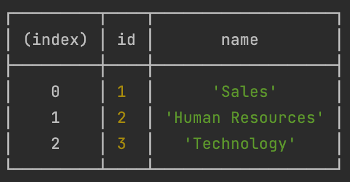
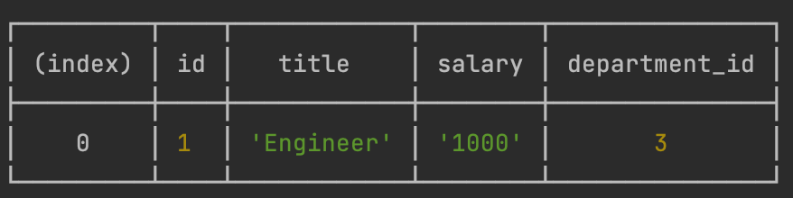

# Employee-CMS

A professional CMS.

## Description

The best content management system.





## Table of contents

* [Usage](#Usage)
* [Installation](#Installation)
* [Demonstration](#Demonstration)

## Usage

Fill the prompts with the information for the new departments, roles and employees then visualized all the data in a
neatly formatted table.

## Demonstration

Here is a video demonstration.

[](https://youtu.be/hp3IH3x8wig)

## Installation

You can clone the project from the [repository](https://github.com/JanInquisitor/Employee-CMS).

```bash
    git clone https://github.com/JanInquisitor/Employee-CMS
```

Once you have the project on your machine you can run it with node.

```bash
    node index.js
```

## Contributing

Anyone is welcome to contribute to this project.

## Author

* [JanInquisitor](https://github.com/JanInquisitor)

## License

See the [LICENSE](https://github.com/JanInquisitor) file for information.